[](https://github.com/bodgit/retrohq/releases)
[](https://github.com/bodgit/retrohq/actions?query=workflow%3Abuild)
[](https://coveralls.io/github/bodgit/retrohq?branch=master)
[](https://goreportcard.com/report/github.com/bodgit/retrohq)
[](https://godoc.org/github.com/bodgit/retrohq)


retrohq
=======

A collection of libraries and utilities for some of the [RetroHQ](https://www.retrohq.co.uk)  products.

Full installation:
```
go get github.com/bodgit/retrohq/...
```
Or grab a pre-built binary from the [releases page](https://github.com/bodgit/retrohq/releases).
## jaguarsd
The `jaguarsd` utility currently allows you to create & edit the `.mrq` marquee files that sit alongside ROM images containing additional metadata.

A quick demo:


